## 2.1 High-Level Architecture Diagram
---

```mermaid
graph TB
    %% Users
    User[👥 User]
    
    %% Frontend
    Frontend[🖥️ Frontend<br/>Vue.js Dashboard]
    
    %% Backend API
    Backend[🔧 Backend API<br/>FastAPI Server]
    
    %% AI Core
    AI_Core[🤖 AI Core<br/>ML Pipeline]
    
    %% Data
    Data[💾 Data<br/>Dataset & Models]
    
    %% Services
    Services[📦 Services<br/>scikit-learn, NLTK]
    
    %% Data Flow
    User -->|Uses| Frontend
    Frontend -->|API Calls| Backend
    Backend -->|Processes Requests| AI_Core
    AI_Core -->|Trains & Predicts| Data
    AI_Core -->|Uses| Services
    AI_Core -->|Returns Results| Backend
    Backend -->|Sends Response| Frontend
    Frontend -->|Displays| User
```

## 2.2 Architectural Patterns & Principles
---
- Layered architecture
  - Presentation (Vue frontend)
  - API layer (FastAPI endpoints)
  - Application/Domain (pipeline orchestration, trainers, evaluator)
  - Infrastructure (file I/O for dataset and artifacts)
- Separation of concerns
  - Trainers encapsulate algorithm-specific training
  - Pipeline coordinates preprocessing, training, evaluation, predictions
  - Evaluator computes metrics and persists confusion matrices
- Schema-first API responses
  - Endpoints return typed response models for consistency and safety
- Stateless API
  - Requests are independent; training results are held in process memory for quick iteration
- Config centralization
  - `ai_core/config.py` defines model, vectorizer, and path settings
- Simplicity and observability
  - Console logging during training and analysis; artifacts saved to `results/`

## 2.3 System Components Overview
---
- Frontend (Vue 3 + Vite)
  - Dashboard for training, prediction, dataset analysis, and status
  - Axios client (`src/services/api.ts`) targeting `http://localhost:8000`

- Backend API (FastAPI)
  - `app.py` exposes REST endpoints:
    - `GET /` basic info and status
    - `POST /train` trains LR and NB models and returns comparison and best model
    - `POST /predict` predicts sarcasm for a headline using trained models
    - `GET /analyze` returns basic statistics and word frequency summaries of the dataset
    - `GET /status` does the same thing as the `/` API by return basic information and status data
  - **==ALERT==** CORS configured for local Vite dev server (`localhost:5173`) and that means it will work only for the port 5173

- AI Core (Python package `ai_core`)
  - `training/pipeline.py`: end-to-end orchestration used by CLI and API
  - `models/logistic_regression_trainer.py`: TF‑IDF + Logistic Regression
  - `models/bayes_naive_trainer.py`: CountVectorizer + Multinomial NB
  - `training/evaluator.py`: accuracy, classification report, confusion matrix saving; simple prediction service with confidence
  - `utils/preproces.py`: URL removal, punctuation filtering, stopword removal, tokenization
  - `data/models.py`: data classes for training data, model results, and predictions
  - `config.py`: model/vectorizer/path constants and defaults

- Data & Artifacts
  - `backend/dataset.json`: JSONL dataset consumed on API startup and by CLI
  - `backend/results/`: confusion matrices created during training

## 2.4 Data Flow Description
---
1) Dataset ingestion
   - API startup (lifespan in `app.py`) attempts to open `backend/dataset.json`
   - JSON Lines are parsed; `article_link` is dropped if present

2) Preprocessing
   - `pipeline.prepare_data()` runs `utils/preproces.text_preprocessing()`
   - Text is normalized (URLs removed, punctuation filtered, stopwords removed)

3) Training
   - `POST /train` triggers `pipeline.train_models()`
   - Trainers split data (stratified), vectorize, fit models, and produce `ModelResult`
   - `ModelEvaluator` computes accuracy and prints a classification report
   - Confusion matrices are saved to `backend/results/`

4) Predictions
   - `POST /predict` uses `PredictionService` to preprocess a headline,
     vectorize it with the stored vectorizer, and obtain model predictions
     with confidence scores; a human-readable label is returned

5) Analysis
   - `GET /analyze` generates dataset summaries: class distribution,
     top word frequencies, and text length statistics

6) Frontend consumption
   - The Vue app calls the API via Axios and renders training summaries,
     predictions, analysis insights, and service status

